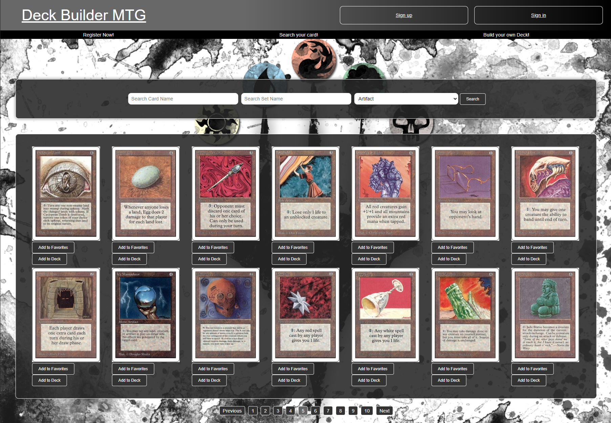

# DeckbuilderMTG
On this webapp you can search specific cards from the game Magic the Gathering.

you can also build your own deck. 
In this version it is not possible yet to save your favorite card and deck in the backend. 

I am planning to make this happen in the future.
## A list of tools that you need for the application
- An IDE -> Webstorm is preferred.
- A browser -> Google Chrome is preferred
- This project
- Git
- NodeJS
- NPM

## Roadmap
1. Install Webstorm
    1. Go to https://www.jetbrains.com/webstorm/.
    2. Click on 'Download'.
    3. Open the .exe file of webstorm to start the installation.
    4. WebStormSetup has opened.
    5. Click on 'Next'.
    6. Choose a destination folder.
    7. Click on 'Next'.
    8. Choose which options you want: this project has .js .css .html and .json.
    9. Click on 'Next'.
    10. Choose start menu folder.
    11. Click on 'Install'.
2. Install Google Chrome
    1. Go to https://support.google.com/chrome/answer/95346?hl=nl&co=GENIE.Platform%3DDesktop for the installation guide.
3. Github
    1. Go to https://github.com/JasperKraamer/MTGDeckBuilder.
    2. Click op 'Code'.
    3. Copy the link.
4. Open webstorm
    1. Activate or start trial
        1. If you start the trial of 30 days. you need to make an account.
        2. Click on start trial
            1. Click on 'Log In to JetBrains Account...'
            2. Create an account with your email address
            3. Open the email of JetBrains
            4. Confirm your account (link is in the email)
            5. Fill the required input-fields
            6. Click on 'Submit'
            7. Go back to webstorm
            8. Click on 'Close'
    2. Click on 'Get from VCS'.
    3. Put the URL from the project in the input-field 'URL: '.
    4. Click on 'Download and Install' (GIT).
    5. Click on 'Clone'.
    6. Restart Webstorm so Git will be enabled.
5. Install NodeJS
    1. Go to https://nodejs.org/en/.
    2. Download NodeJS (Recommended is preferred).
    3. Open node-vXX.XX.X-x64.msi. (at this time version 20.11.1)
    4. Click on 'Next'.
    5. Accept the terms if you agree.
    6. Click on 'Next'.
    7. Choose your destination folder.
    8. Click on 'Next'.
    9. Don't change anything and click on 'Next'.
    10. Click on 'Next'
    11. Click on 'Install'.
    12. Restart Webstorm (You need to restart your computer in some cases).
6. Open the terminal of Webstorm (at the bottom of the screen)
    1. Type 'node -v' to check the version of NodeJS.
    2. Type 'npm install' in the terminal and push 'Enter'. This can take some time.
7. Type 'NPM start' in the terminal

### The application will be automatically opened in the browser.
### To use the application you need to signup first, because there aren't any accounts yet.
# Enjoy! 